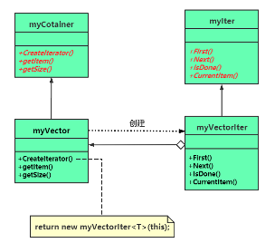

# chap10 - 迭代器模式

是一种行为型模式。

早期的 C++模板中，迭代器 与 容器， 一开始是将迭代器写入了一个类模板中， 现在是将迭代器单独实现为一个类模板

## 1 - 容器 与 迭代器 的简单范例

略

## 2 - 单一职责原则 （Single Responsibility Principle，SRP）

### 单一职责原则的定义

一个类应该只有一个引起变化的原因，通俗的说：就是一个类的职责应该单一，
应该只做一类事情或者对外只提供一种功能。

如果将 容器 与 迭代器写在一块儿。
容器功能：插入数据等；迭代器功能：遍历数据。
如果写在一块儿，就是破坏了 单一职责原则。

### 内聚 与 耦合

内聚性：用于衡量一个模块（类）紧密的达到单一目的特性，指的是从功能角度来度量模块内的联系。
当一个模块被设计成：只支持一组相关功能的时候，它就属于高内聚。
不过被设计成支持一组不相关的功能 —— 低内聚。

耦合性：模块之间相互关联的程度。取决于两者间的接口的复杂程度。相互间的调用方式，以及调用时哪些信息需要交互。

模块之间的耦合性，几种类型（从高到低）：

1. 内容耦合，一个模块直接修改或者操作另一个模块的数据，应该避免使用
2. 公共耦合，两个模块共同使用一个全局对象等公共的资源
3. 外部耦合，一组模块都访问一个简单全局变量，而不是数据结构。（限制公共耦合的范围）
4. 控制耦合，通过传参，（少用）
5. 标记耦合，传递数据结构
6. 数据耦合，模块之间通过参数传递数据

程序设计：高内聚，低耦合（单一职责原则）

一个类的职责越单一，内聚度就越高。
要达到低耦合的目的，也要尽量遵循依赖倒置原则 —— 高层组件和低层组件 都依赖于 抽象层
或者说是 尽量使用抽象耦合来代替具体耦合。

## 3 - 迭代器模式的范例 及 现代 C++ 中的迭代器

现代 C++的 迭代器都做到了，不暴露 容器内部结构的情况下，让迭代器透明的访问容器中包含的元素的效果。

定义：提供一种方法 顺序访问一个聚合对象（容器）中各个元素，而又不暴露该对象的内部表示（内部表示：实现代码）。

迭代器中的 4 种角色：

1. Iterator（抽象迭代器）：用于定义访问和遍历容器中元素的接口
2. ConcreteIterator（具体迭代器）：MyVector 类模板
3. Aggregate（抽象聚合，也就是抽象容器）：用于存储和管理元素对象，充当创建迭代器的工厂角色
4. ConcreteAggregate（具体聚合）：实现了抽象聚合的 CreateIterator()

### 迭代器模式范例

看`s3.cxx`

### 现代 C++ 中的迭代器

迭代器模式，在 现代 C++ 中或许已经过时了
