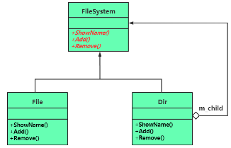

# chap11 - 组合模式 - 树形结构

结构型模式，主要用来处理树形结构的数据。

## 1 - 一个基本的目录内容遍历范例

具体请看`s1.cxx`

## 2 - 使用组合模式改造目录内容遍历范例

组合模式，就不是将 File 与 Dir 分开，而是引入一个抽象类（filesystem），
提供一个公共接口 ShowName，然后继承有 File 和 Dir

## 3 - 引入组合(somposite)模式

定义：将一组对象（文件、目录）组织成树形结构，以表示 “部分-整体” 的层次结构
（目录中包含文件和子结构），使得用户对单个对象（文件）和组合对象（目录）的操作/使用/处理（递归遍历并执行 showName 的逻辑）具有一致性。

一致性：不用区分 树叶、树枝，两者都具有相同的接口 ShowName。

发挥作用的前提：具体数据必须能以属性结构的方式表示，树中包含了单个和组合对象。
该模式专注于树形结构中单个对象和组合对象的递归遍历。
并且能把相同的操作（FileSystem 定义的接口）应用在单个以及组合对象上，并且可以忽略单个对象和组合对象的差别.

组合模式，其实应该叫做 树形模式，有三种角色：

1. component（抽象组件）：为树枝树叶定义抽象接口，增加删除、获取孩子等。包含所有子类公共行为的声明 和 缺省的实现体。
   这里是 FileSystem
2. leaf（叶子组件），component 定义的抽象接口，在叶子组件中有些接口并没有什么意义。也就是这里的 File 类。这种叶子组件，并不止一个。
3. composite（树枝组件）：用来表示一个容器，或者树枝。可以包含子节点，子节点可以是树叶，也可以是其他树枝。也就是这里的 Dir 类

比方说：photoshop 中的 图层的显示 问题。

优点：

1. 简化代码书写：客户端可以忽略 单个对象与组合对象 的层次结构的差异，可以一致的使用 单个对象 和 组合对象。
2. 如果我要增加新的类型，除了目录类型，还有符号链接类型，这个时候我只用拓展代码就行了，符合开闭原则
3. 处理复杂的树形结构
4. 抽象组件其实可以为 叶子提供缺省的实现代码（Add、Remove）
5. 可以有指向父结点的指针，语法分析树（编译原理）适合这种 组合模式

组合组件内部的容器，这里是用的 list 链表，当然也可以来一个红黑树，哈哈哈

## 4 - 透明组合模式 与 安全组合模式

我们这里的 FileSystem 例子，Add、Remove 这种管理子节点的成员函数，
这些成员函数，只有在树枝类才有实际意义。这种在 抽象类 中就定义的 子节点的管理手段，就叫做：透明组合模式。我们这里的 FileSystem 就是 透明组合模式。
好处就是：所有的具体子类，都具有相同的接口。缺点就是：必须在叶子类中实现这些接口，尽管没有实际意义。
还有缺点就是：容易被误用。当然我们是可以在叶子节点的 Add、Remove 中抛出异常，但是这在编译阶段其实没法被发现。

因此：引入安全组合模式。

安全组合模式：抽象组件中用于管理 和 访问子节点的成员函数 被转移到了 树枝组件中。

组合模式：透明性（将接口写在抽象类中）、安全性（写在 聚合组件 中）不可兼得

但是我感觉，如果是 透明组合模式，可以将 子类的重写的函数，访问等级设置为 private

## 5 - 其他使用组合模式的场景探讨

杀毒软件，可以给`class File`设置一个子类，子类的特征是包含后缀`.exe`，重点查杀
