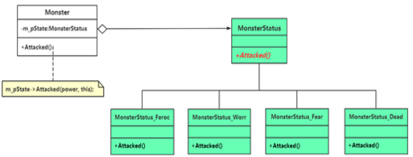

# chap12 - 状态模式

是一种行为型模式，有限状态机。
突出特点：用类来表示状态 —— 跟策略模式有 异曲同工之妙，策略模式用类来表示策略

## 1 - 一个基本的状态转换模式

有限状态机（Finite State Machine，FSM），简称状态机。

当某个事件（转移条件）发生时，会根据当前状态决定哪种动作，然后进行下一种状态。

约定：怪物生命 500：

1. 血量 > 400，怪物凶悍，反击
2. 100 < 血量 <= 400，怪物不安，反击并呼唤附近其他怪物来支援
3. 血量 <= 100，怪物恐惧，逃命
4. 血量 <= 0，怪物死亡

状态机我可太熟悉了，verilog 实验真实艹了 🥚 了。

这种`enum`和`switch`写的状态机，拓展性差

状态类的存在价值：使业务逻辑代码更加清晰 和 易于维护，看`s2`

`s2`的问题就是，`Monster.cxx`中的代码，依然有很多的 if-else，
看起来特别的繁杂，而且扩展性很差

## 2 - 引入 状态（status）模式

我们只是通过：如果不是当前状态`if`，那么就是无条件转入下一个状态`else`。
这个不一定好用，还是要具体情况具体分析。

看`s3`，这种编码方式，将 Monster 中的状态，几乎都放到了 MonsterStatus 中。

如果引入了新状态，我们不用修改 Monster 类，只用修改 MonsterStatus 的相关类。
这不算完全符合开闭原则，但是还是好的，单一职责原则。

定义：允许一个对象（也就是这里的怪物）在其内部状态改变（从凶悍改变为不安状态）时改变其行为（比如从疯狂反击并呼唤支援）；
对象看起来似乎修改了他的类（状态发生了变化，其行为也发生了改变，比方说从 呼唤支援 --> 逃跑，看起来，对象已经不属于当前类，而是属于一个新类了，单一职责原则，
毕竟类对象的行为都发生了变化。而实际上怪物对象，只是引用了不同的状态对象，造成看起来像是怪物所属的类发生了改变的假象）
状态模式，允许一个对象基于各种内部状态，拥有不同的行为。他将一个对象的状态从对象中分离出来，封装到一系列的状态类中，达到状态的使用以及扩充都很灵活的效果

客户端代码，不用关系当前对象处于何种状态，也不用关心状态的转化问题，一个对象在一个时刻，有且只能处于状态的一种。

UML 类图的三种角色：

1. context（环境类，上下文类）：这个类的对象拥有多种状态，以便对这些状态进行维护。也就是这里的 Monster 类。
2. Status（抽象状态类）：封装与环境类的一个特性状态相关的行为，在抽象状态类中，声明不同的状态对应的方法，在子类中实现对应的方法。
   如果相同，或者是缺省的实现方法（公用的实现方法），也可以实现在抽象状态类中。
3. ConcreteStatus（具体状态类）：抽象状态类的子类，用于实现与环境类该状态相关的行为，也就是环境类的行为，委托给状态类来实现。

如下两种情况下可以考虑使用状态模式：

1. 对象行为去取决于对应其状态，该对象需要根据状态来改变行为
2. 一个操作中含有潘达的条件分支语句，这些分支语句的执行依赖于对象的当前状态
3. 当一个项目中 某对象的状态特别复杂时，可以使用 查表法 —— 对象状态转移，避免引入太多的状态类

### 策略模式 与 状态模式对比

策略模式，需要客户端主动的传入状态

## 3 - 状态类的 单例实现

s3 例子中，我们每次都 new 了一个 具体的状态，实际上是不需要的，
可以将状态类设置为单例的。

看`s4`
