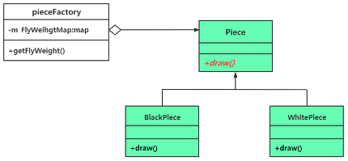

# chap13 - 享元模式

flyweight - 次 最轻量级 拳击运动员。（让对象占用的内存变少）

享元模式：蝇量模式。

结构型模式：解决的是 面向对象程序设计的 性能问题。

享元：被共享的 单元 或者 被共享的对象

设计思想：当需要某个对象时，尽量共用已经创建出的同类对象 从而 避免频繁使用 new 创建同类或者相似的对象

## 1 - 从一个典型的范例开始

围棋：19 x 19 = 361 棋盘。 当然也可以通过 设置一个 list，保存棋局， 方便以后可以复盘

```cxx
int main(void)
{
    Piece* p_piece1 = new Piece(Black, { 3, 3 });
    p_piece1->draw();
    Piece* p_piece2 = new Piece(White, { 5, 5 });
    p_piece2->draw();
    Piece* p_piece3 = new Piece(White, { 6, 6 });

    delete p_piece3;
    delete p_piece2;
    delete p_piece1;
    return 0;
}
```

可以看到，这里创建了很多棋子对象。但是，其实没必要创建那么多棋子对象。
其实可以看到，这里也就位置不一样，没必要每次都创建一个新的 颜色。

```cxx
/**
 * @brief 创建棋子的 简单工厂
 *
 */
class PieceFactory {
public:
    virtual ~PieceFactory()
    {
        /* 释放内存 */
        for (auto v : m_FlyWeightMap) {
            delete v.second;
        }
        m_FlyWeightMap.clear();
    }

    /**
     * @brief Get the Fly Weight object 获取被共享的 棋子对象
     *
     * @param tmpcolor
     * @return Piece*
     */
    Piece* getFlyWeight(EnumColor tmpcolor) // FIXME 核心代码
    {
        auto iter = m_FlyWeightMap.find(tmpcolor);
        if (iter == m_FlyWeightMap.end()) {
            /* 没有该享元对象，那么就创建出来 */
            Piece* tmpfw = nullptr;
            if (tmpcolor == Black) {
                tmpfw = new BlackPiece();
            } else {
                tmpfw = new WhitePiece();
            }
            m_FlyWeightMap.insert(make_pair(tmpcolor, tmpfw));
            return tmpfw;
        } else {
            return iter->second;
        }
    }

private:
    std::map<EnumColor, Piece*> m_FlyWeightMap; // 用 map 容器保存所有的享元对象，一共就两个香享元对象（黑色棋子一个，白色棋子一个）
};
```

## 2 - 引入享元（flyweight）模式

该模式避免了程序中出现大量相同或者相似的对象。该模式通过共享对象的方式，实现了相似对象的重用

定义：运用共享技术 有效地支持大量细粒度的对象（的独用），
享元模式一般包含了对简单工厂模式的使用。

享元模式，一般把创建的共享对象保存在一个容器中，这个容器一般称之为 “享元池”

下面是享元对象的 uml 类图：



享元对象，有一个重要的概念：

1. 内部状态：存储在享元对象内部，一直不会发生改变的状态，比方说这里的黑色。这种状态可以被共享，而且这种状态会写成一个 子类。像这里的颜色
2. 外部状态：随着外部环境和各种运动因素的改变而发生的状态，这种状态不可以被共享。比方说这里黑白棋的位置

享元模式的目的：减少对象数量，节省内存，提高程序运行效率。

三种角色：

1. FlyWeight（抽象享元类）：声明各种享元类的接口，在子类中实现该接口。外部状态作为参数，传递进这些方法中。也就是这里的 Piece 类
2. ConcreteFlyWeight（具体享元类）：抽象享元类的子类 BlackPiece、WhitePiece
3. FlyWeightFactory（享元工厂类）：内部维护一个享元池，享元对象放入池中，返回一个已经创建的享元对象。（可以考虑用单例实现）

比方说：游戏场景中，用来装饰的树木，其实实际上也就几个这种树木。
但是这种树木的渲染，实际上每个都是要渲染的。实际上并不能提高图形渲染的性能。

使用情形：

1. 程序中有大量相同或者相似对象造成内存大量消耗
2. 对象的大部分状态都是可以转变成外部状态，并且这些外部状态都是通过参数传入到对象之中
3. 享元池的引入 增加了程序实现的复杂性，当然享元池也有一定的性能开销，因此：使用享元模式要衡量性价比

不想将 享元模式 与 对象池、连接池、线程池等混为一谈。
对象池等都是减少创建对象的时间开销，以及增加创建对象的可靠性。
