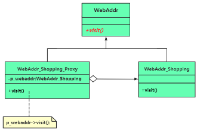

# chap14 - 代理模式

目的：为客户端增加额外的功能、约束或针对客户端的调用屏蔽一些复杂的细节问题。

比方说：海外代购，本地买不到，让代购帮忙购买，这个代购也是扮演了一个 代理的角色

## 1 - 基本概念 和 范例

通过引入代理类，来为原始类（被代理类）增加额外的能力 —— 新功能、新服务，也有可能是约束 或者 限制。
使用代理类的程序员 与 开发这个代理类的程序员 并不是同一个程序员，甚至可能是两个不同公司的程序员。

例子，访问网站

A 公司的内部 web 网站，对外开放，但是要收费。
这个网站开发 与 流量计费 肯定是分开的，单一职责原则。
流量计费通常是写在了这个 代理类中。
B 公司购买这个网站，也肯定是代理类。

这种可太多了。比方说最近很火的 gpt 的 api。

## 2 - 引入代理(proxy)模式

定义：为其他对象提供一种代理 以控制对这个对象的访问。

三种角色：

1. subject（抽象主题）定义 真实主题 与 代理主题 的共同接口。抽象主题不一定存在，也不一定有共同接口。是这里的 WebAddr
2. proxy（代理主题）内部包含了 对真实主题的引用，从而可以对真实主题进行访问。代理主题 可以对 真实主题 进行限制。WebAddr_Shopping_Proxy
   也能够控制 只在必要的时候 创建或者删除真实主题
3. realSubject（真实主题）也就是 WebAddr_Shopping

代理模式 与 装饰模式对比：

- 代理模式：代表真实主题，并给真实主题增加一些新功能 或者 新职责。与真实主题要实现的功能 可能没有相关性。
  主要是控制对真实主题的访问
- 装饰器模式：引入装饰类，装饰各种构件，为具体构件类增加一些相关的能力。与原有构件的能力 具有 相关性。
  是对原有构件的 能力 或者 行为进行 拓展 或者 增强。

下面是代理模式的 uml 图：

## 3 - 代理模式的应用场景探究

### 代理模式常用应用场景

常见的代理包括 但不限于 如下这些类型：

1. 远程代理 remote proxy：为一个对象 在不同地址空间的对象 提供一个局部代表，或者是本地代理对象。
   可以是 同一个计算机上两个不同的程序。也可以是 网络空间上，通过 socket 进行通讯的程序。
2. 虚拟代理 virtual proxy：如果创建一个对象，需要消耗大量的资源，可以创建一个消耗较小的对象。
   也就是扮演真实对象的替身。只有真实对象被真正需要的时候才会创建。
   比方说：浏览器中包含一个巨大的图片，浏览器中会短暂的显示一个小图标说明大图片在传送中，传输完毕后，会将这个小图标替换成大图片。
3. 保护代理 protect proxy：访问原始对象之前、之后执行许多额外操作，来控制对原始对象的访问。
   比方说：给不同的用户提供不同的访问级别。
4. 缓冲代理 cache proxy：针对某个目标操作的结果，提供临时存储空间，以便多个客户端可以共享这些结果。
5. 智能引用代理 smart reference proxy：当一个对象被引用的时候，做一些额外的操作，比方说记录引用次数，比方说 shared_ptr，用于包装裸指针。
   这就不一定有 抽象主题，把裸指针当做 真实主题，把 shared_ptr 当做是 代理主题
6. 写时复制 copy-on-write 优化代理：string 类看成是对 char \* 的代理。
7. 防火墙代理、同步代理（多线程安全访问）、复杂隐藏代理等

### 缓冲、缓冲代理 范例

读文件，并不是一行一行读取，而是一次读取很多行。调用一次，返回一行。

看`s3.cxx`
