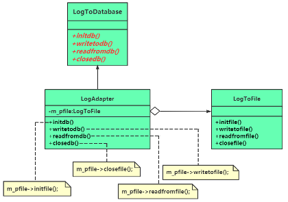
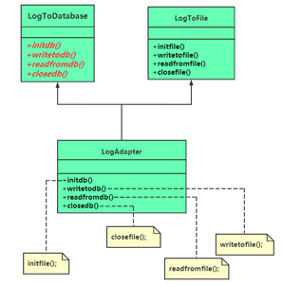

# chap15 - 适配器模式

是一种：结构型模式。为了解决 兼容性 问题

生活中的各种转接头，电源适配器

两个类中，也有可能出现兼容性问题，引入一个 适配器。

## 1 - 一个简单的范例

公司某个对外提供服务的项目，需要记录一些日志信息，方便运营人员查看、追溯。
日志准备写到一个固定的日志文件中，于是程序开发人员向项目中增加了一个 LogToFile 的类来实现日志系统。

我们有 LogToFile 也有 LogToDB，其中这两个类的 成员函数是不相同的。

我们会同时向 db 、File 中写日志。db 可能是一个服务器，远程连接的。

1. 然而有一天，意外情况发生。db 服务器断联了：
2. 要从以往使用 LogToFile 类所生辰的日志文件中读取一些日志文件。然而 db 与 file 的接口是不相同的。

不太可能从源码级别修改 LogToFile，有如下制约因素：

1. 我们的 LogToFile 是老员工写的，但是老员工离职了，迁移很麻烦
2. LogToFile 以库的形式提供给项目，源码拿不到

解决这个问题，比较好的，简单的方法就是：使用适配器。

适配器的能力：将对一种接口的调用，转换为对另一种接口的调用。

说明：

我们的例子中，接口之间的转换是 一对一的，实际上不一定是一对一的。
在 writeTodb 到 writeToFile 中间可能会插入很多其他的函数。

1. 存在转换的可能，这两种接口之间有一定的关联关系（自来水管 不可能与 煤气管道配接在一起）
2. 转换很可能不是一对一的，而是一对多的。可能转换起来很复杂。

## 2 - 引入适配器（adapter）模式

定义：将一个类的接口转换为 客户希望的另一个接口。
该模式使得原本接口不兼容而不能一起工作的类可以一起工作。

别名：包装器 wrapper



三种角色：

1. target（目标抽象类）：LogToDatabase，定义所需要暴露的接口（调用者希望使用的接口）
2. Adaptee（适配者类）：被适配的角色，也就是这里的 LogToFile，老接口。
3. Adapter（适配器类）：也就是这里的 LogAdapter 类，核心，用来调用另一个接口。

不想大改客户端，根本不想改 被适配者。

装饰模式是：不改变老接口的调用方式。而适配器模式是：就是要改老接口。

## 3 - 类适配器

1. 对象适配器（类与类之间的组合关系） ---> 委托组合关系（包含指针）
2. 类适配器 ---> 通过类与类之间的继承关系来实现接口的适配

类适配器不如 对象适配器灵活。
对象适配器中使用的是指针，他其实可以指向抽象类的子类。
而这里的类适配器，他是写死的，不灵活。

```cxx
/**
 * @brief 类适配器，一个私有继承，一个公有继承
 *
 * 其实本质上是一样的，私有继承就是组合关系
 */
class LogAdapter : public LogToDataBase, private LogToFile {
public:
    void initdb()
    {
        cout << "在LogAdapter::initdb() 中适配 LogToFile::initdb()" << endl;
        initFile();
    }

    void writedb(const char* pContent)
    {
        cout << "在LogAdapter::writedb() 中适配 LogToFile::writeToFile()" << endl;
        writeToFile(pContent);
    }

    void readFromdb()
    {
        cout << "在LogAdapter::readFromdb() 中适配 LogToFile::readFromFile()" << endl;
        readFromFile();
    }

    void closedb()
    {
        cout << "在LogAdapter::closedb() 中适配 LogToFile::closeFile()" << endl;
        closeFile();
    }
};
```



## 4 - 适配器模式的扩展运用

过多的使用 适配模式，并不是一个好的解决方案。
一般是只有迫不得以才进行适配的。重构肯定要比 适配好。

新版本不可能直接抛弃掉老版本。

C++标准库中体现的淋漓尽致：

容器适配器、算法（函数）适配器、迭代起适配器：把一个既有的东西进行适当的改造，
比如增加或者减少一点东西就成为了适配器

容器适配器：deque ---> stack、queue（这两个是容器适配器）

算法适配器：`std::bind`绑定器

迭代起适配器：reverse_iterator（反向迭代器），对 iterator 的一层简单封装
