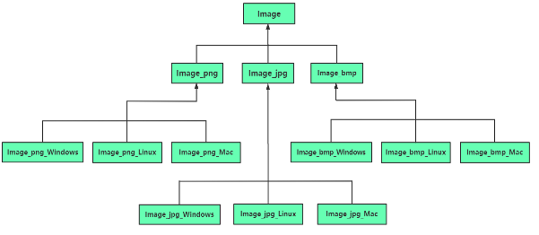
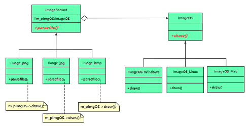

# chap16 - 桥接模式

是一种 结构型模式。

解决的问题：根据单一职责原则，在一个类中，不要做太多事情；如果事情很多，尽量才分到多个类中去，
然后在一个类中包含指向另一个类对象的指针，当需要执行另一个类中的动作时，用指针直接去调用另外一个类的成员函数

## 1 - 一个传统的继承范例 导致子类数量爆炸式增长

在游戏中，不可避免的要显示各种图像，人物头像，血条，人物背包，道具贴图等，
图像源自于图像文件。按照实现约定好的格式规范，保存到一个缓存区中，以方面后面统一的实现处理。

然而，图像文件有多种格式：png、jpg、bmp 等。
但是我们读取到一个统一的格式以后，就没有差别了。

我们现在就是要将这些不同格式的问题读取处理，存放到统一格式，最后显示出来。

但是现在有点问题，就是我如果想要游戏能够跨平台，
我们现在已知：mac、linux、windows 的渲染是不一样的， parsefile 是一样的

那么我们就会得到下面的这个 uml 类图：



我们的类迅速膨胀了

显然：如果使用继承结构拓展类，显然是不好拓展的

## 2 - 将类与类之间的继承关系改为委托关系

类与类之间：继承、组合（委托）

文件格式：png、jpg、bmp。操作系统类型：windows、linux、mac。

1. parsefile 实现代码与具体操作系统类型无关
2. draw 不同操作系统，用于显示 pData 的实现代码不同（DirectX、opengl）

```cxx
int main(void)
{
    /* 通过在主流程中 装配 */
    ImageOS* pImgOS_Windows = new ImageOS_Windows();
    ImageFormat* pImg_Png = new Image_png(pImgOS_Windows); /* 桥接 */
    pImg_Png->parsefile("fuck.png");

    delete pImg_Png;
    delete pImgOS_Windows;
}
```

桥接模式的 uml 图：



我们可以看到，这里都是依赖于抽象

程序员的眼光问题，有两个独立变化的维度：操作系统，图像文件格式。
眼光就是要看清楚这两个不同的维度。

变动这两个维度中的任何一个维度，都不能对另外一个维度产生影响。
不同维度的独立变化，才是能够顺利使用桥接模式的前提。

## 3 - 引入桥接（bridge）模式

定义：将抽象部分与他的实现部分分离，使他们都可以独立的变化和拓展。

- 抽象部分：一般指 业务功能，比方说这里的 ImageFormat 类
- 实现部分：一般指 具体平台实现，比方说 ImageOS 类

观察 UML 图，桥接模式：imageOS 与 imageFormat 中间通过一个指针连接。
这个指针像：连接两个独立继承结构的桥。

四种角色：

1. Abstraction 抽象部分相关接口：ImageFormat 类，其中包含 一个实现相关接口的指针
2. RefinedAbstraciton（扩充抽象部分接口）：Image_png、Image_jpg、Image_bmp 类。实现抽象类中的接口，并且可以调用实现类的成员方法
3. Implementor（实现部分相关接口）：ImageOS 类，仅提供最基本的方法。Abstraction 会提供更加复杂的方法
4. ConcreteImplementor（实现部分具体类）：ImageOS_windows、ImageOS_linux、ImageOS_Mac 类

体现了 单一职责原则、开闭原则、组合复用原则、依赖倒置原则。

主要是：识别出两个维度，需要经验积累。
