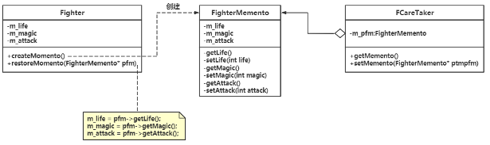

# chap18 - 备忘录模式

又被称为 快照模式 snapshot，是一种行为型模式。
用于防止数据丢失，对数据进行备份，以备将来恢复数据而采用的设计模式。

可以将某个时间点的对象保存下来，以便后面恢复这个对象。

## 1 - 一个具体实现范例

每个关卡末尾，都有一个 boss，boss 很 nb，只有成功击败 boss，才能进入下一个关。

策划：兄弟，传火吗？然后可以保存，保存当前游戏进入，哈哈哈。

一般来说，备忘录模式 还会引入一个 “管理者”类（负责人），
会持有一个指向备忘录对象的指针，用来存取备忘录对象。
什么时候创建备忘录，什么时候保存备忘录指针，就可以由管理者类

## 2 - 引入备忘录(Memento)模式

定义：在不破坏封装性的前提下（该隐藏的信息，依然要隐藏，原发器中的成员变量，在 备忘录中的访问级别应该是一样的），
捕获一个对象的内部状态（指的是 原发器类），并在该对象之外保存这个状态（在原发器之外保存对象），这样以后就可以将该对象恢复到原先保存的状态。

备忘录模式的三种角色：

1. originator（原发器）：也就是这里的 Fighter 类，是一个普通类，可以创建一个备忘录保存当前的状态。将需要保存状态的类：原发类
2. Memento（备忘录）：备忘录的设计，一般参考原发器的设计。除了原发器对象外，其他对象不应该直接访问 备忘录，所以一般都是 private，将原发器类设置为友元
3. CareTaker（管理员）：也就是这里的 FacreTaker。用来保存备忘录，也可以将备忘录传递给其他对象。但不需要知道备忘录的细节，也不能对备忘录中的内容进行操作和检查。

备忘录真正的作用：并不是保存数据，而是恢复数据。保存的目的是恢复

说明：

1. 把原发器类中的信息保存到 备忘录中，这称为给 原发器做的一个快照。但是这不意味着：所有原发器类的信息都要往 备忘录中保存，并非字段都是一一对应的。
2. 做快照并不要求玩家主角类需要保存的字段都 一一对应 备忘录中相同的字段，备忘录中可以以 内存流、字符串、编码方式（数据序列化）存储或者还原来自玩家主角的数据。
3. 给玩家主角做快照并不仅限于一次，可以做多次快照，那么就要考虑性能问题，存储位置问题（可以参考`s3.cxx`）
4. 更适合保存原发器对象的一部分状态（而不是所有内部状态），否则采用原型模式或许是更好的方法
5. 有点：方便回到一个特定的历史步骤。缺点：对资源的消耗
6. 完全存储(RDB)。增量(AOF)存储来应付频繁的做快照（相对于上一份快照的增量）。
7. 完全存储和增量存储的方式结合使用，减少需要记录的数据
8. 应用场合：下棋悔棋，保存里氏记录，做快照。
9. 数据保存在磁盘中，以及从磁盘中恢复数据。
