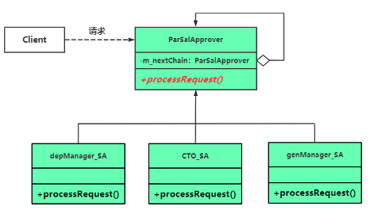
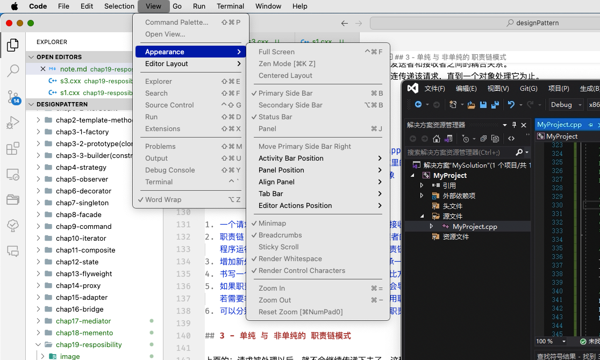

# chap19 - 职责链模式

也叫做：责任链模式，是一种行为型模式。将一个请求传递给一个链的若干个对象。
看起来与链表非常类似。

## 1 - 一个关于涨薪审批的范例

加薪请求，看做一个对象。

- 加薪 <= 1000，部门经理审批。
- 1000 < 加薪 <= 5000， 技术总监审批
- 加薪 > 5000，总经理审批

按照传统的方式写一个加薪请求：

```cxx
class SalaryHandler {
public:
    /**
     * @brief
     *
     * @param sname 员工名字
     * @param salfigure 加薪多少
     */
    void raiseRequest(const string& sname, int salfigure)
    {
        if (salfigure <= 1000) {
            depManagerSP(sname, salfigure);
        } else if (salfigure <= 5000) {
            CTOSP(sname, salfigure);
        } else {
            genManagerSP(sname, salfigure);
        }
    }

private:
    void depManagerSP(const string& sname, int salfigure)
    {
        cout << sname << "的加薪要求为: " << salfigure << "元，部门经理审批通过!" << endl;
    }

    void CTOSP(const string& sname, int salfigure)
    {
        cout << sname << "的加薪要求为: " << salfigure << "元，技术总监审批通过!" << endl;
    }

    void genManagerSP(const string& sname, int salfigure)
    {
        cout << sname << "的加薪要求为: " << salfigure << "元，总经理审批通过!" << endl;
    }
};
```

但是有个问题，如果后面我们增加一个职务：副总经理，那么就不符合开闭原则了。

我们分别为：部门经理 --> 技术总监 --> 副总经理 --> 总经理 分别创建类，并且这三个职位继承同一个父类，
然后我们将这几种职位像链表一样，链接起来。

当来了一个加薪请求，那么就将这个请求在链上传递

```cxx
/**
 * @brief 加薪审批者父类
 *
 */
class ParSalApprover {
public:
    ParSalApprover()
        : m_nextChain(nullptr)
    {
    }
    virtual ~ParSalApprover() { } /* 虚析构 */

public:
    /**
     * @brief Set the Next Chain object
     *
     * @param next
     */
    void setNextChain(ParSalApprover* next)
    {
        m_nextChain = next;
    }

    /**
     * @brief 处理加薪请求
     *
     * @param req
     */
    virtual void processRequest(const RaiseRequest& req) = 0; // TODO

protected:
    /**
     * @brief 在链中找下一个对象，并发请求投递给 链的下游
     *
     * @param req
     */
    void sendRequestToNextHandler(const RaiseRequest& req)
    {
        if (m_nextChain != nullptr) {
            /* 把请求传递给链的下一个对象 */
            m_nextChain->processRequest(req);
        } else {
            /* 没找到链中的下一个对象，程序流程不应该走到这 */
            cout << "error: " << req.getName() << "的加薪要求为: " << req.getSalFigure() << endl;
        }
    }

private:
    ParSalApprover* m_nextChain; /* 指向下一个审批者对象 的多态指针，链表 */
};
```

这个父类确实有意思，这个父类实现了绝大部分代码，只用子类实现一个接口就行了。

## 2 - 引入职责链模式(chain of responsibility)

定义：是多个对象都有机会处理请求，从而避免请求发送者和接收者之间的耦合关系。
将这些对象连成一条链（构成对象链），并沿着这条连传递该请求，直到一个对象处理它为止。



3 种角色：

1. handler（处理者），也就是这里的 ParSalapprover 类，定义了处理请求的接口。也记录了下一个处理者是谁
2. ConcreteHandler（具体处理者），也就是这里的 depManager_SA，CTO_SA，genManager_SA
3. client（客户端），搭建职责链，提交请求对象

职责链 模式特点：

1. 一个请求可能有多个接收者，但是最后只有一个接收者处理该请求。请求的发送者和 请求的处理者是解耦的。请求者不关心 处理细节
2. 职责链 的每个接收者，只用保存一个 指向后继者的指针。当然，职责链也有 环形、树形的职责链。但是要注意，不要让程序陷入死锁状态。
   程序运行期间，可以动态的添加、修改、删除职责链上的接收者，使针对请求的处理更具有灵活性。这是职责链模式的重要特色
3. 增加新处理者不需要修改 现有的代码，只用继承一个新的子类，并实现接口。符合开闭原则
4. 书写一个缺省的处理方式，放到职责链的末尾。比方说：不管加薪多少，总经理都能给你审批。
5. 如果职责链比较长，而处理者又比较靠后，可能会导致请求处理的延迟。
   若需要非常快的请求处理速度，则要权衡是否使用职责链模式
6. 可以分别选择不同的接收者对象，可以创建多条职责链以增加接收者在职责链模式中的复用性。

## 3 - 单纯 与 非单纯的 职责链模式

上面的：请求被处理以后，就不会继续传递下去了，这种就是：单纯的职责链模式。

非单纯的职责链模式：允许一个请求被处理以后，继续沿着职责链传递，其他处理者仍有机会继续处理该请求。
这种职责链也称之为：功能链。
即便一个请求未被任何处理这对象处理也允许。
一般用于权限的多次校验，数据的多重检查和过滤等

范例：敏感词过滤器，看`s3.cxx`

职责模式也常被用于：视窗系统，比方说 mac 上面的


