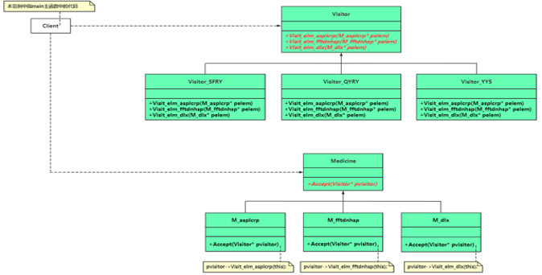
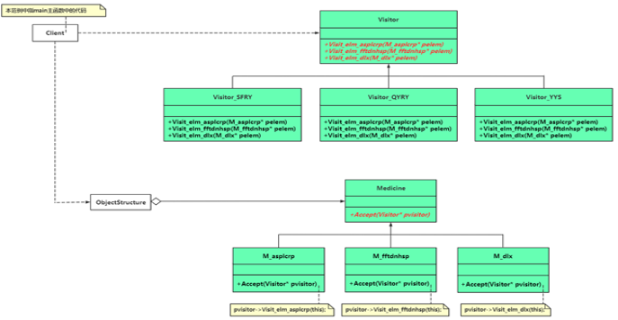

# chap20 - 访问者模式

又叫做：访问器模式，是一种行为型模式。

核心就是要理解这个 `Accept` 函数

## 1 - 一个具体范例的逐渐演化

```cxx
class MedicineProc {
public:
    /**
     * @brief 增加药品到药品列表中
     *
     * @param p_mdc
     */
    void addMedicine(Medicine* p_mdc)
    {
        m_mdcList.push_back(p_mdc);
    }

    /**
     * @brief 针对费用缴纳 和 取药所做的处理动作
     *
     * @param strvisitor 拿到了药品单的人，不同的人拿到药品单 所要做的事情不同
     */
    void procAction(string strvisitor)
    {
        if (strvisitor == "收费人员") {
            float totalCost = 0.0f; /* 总费用 */
            for (auto v : m_mdcList) {
                float tmpPrice = v->getPrice();
                printf("药品: \"%s\", 的价格为: %.2f\n", v->getMdcName().c_str(), tmpPrice);
                totalCost += tmpPrice;
            }
            printf("所有药品的总价为: %.2f, 收费人员收取了我的费用!\n", totalCost);
        } else if (strvisitor == "取药人员") { /* 取药人员要根据药品单为我拿药 */
            for (auto v : m_mdcList) {
                printf("取药人员将 \"%s\" 拿给了我\n", v->getMdcName().c_str());
            }
        } /* 健身教练、营养师 */
    }

private:
    list<Medicine*> m_mdcList;
};
```

比方说这里，每当新加一个新角色，拿到药品单以后，就会有新的 if-else 分支，这违反了 开闭原则。

可以使用 访问者模式，代替 屎山的 if-else

访问者模式，包含两个重要角色：访问者（收费人员、取药人员、营养师、健身教练），被访问者（元素）（这里的药品单及其包含的三种药品）

串门、查看一个东西，这些都是有 访问者、被访问者

## 2 - 引入一个访问者(visitor)模式

定义：提供一个作用于 某对象结构中的各操作表示，使可以在不改变各元素的前提下，定义（扩展）作用于这些元素的新操作

解释：允许一个或多个操作（不同的访问者）应用到一组对象（不同的药品）上，是对象本身的操作解耦

下面是 访问者模式的 UML 图



访问者模式的不同角色：

1. visitor（抽象访问者）：为对象结构中的每个一元素子类（药）。声明一组访问操作接口，具体访问者子类要实现这些接口
2. ConcreteVisitor（具体访问者）：实现每个 由抽象访问者声明的访问操作，每个操作用来访问 被访问者对象的一个元素
3. Element（抽象元素）：也就是这里的 medicine，定义了一个 Accept，被访问者要接收访问，Accept 的形参是 visitor
4. ConcreteElement（具体元素）：也就是这里的这三种药，每一个都实现了 Accept 方法，Accept 方法中，调用了 访问者子类的 自身的访问操作
5. ObjectStructor（对象结构）：是一个集合，用来存放元素对象，并提供遍历其内部元素的接口

下面是完整的访问者模式，也就是多了一个 ObjectStructure



最后执行的：既依赖于 药物类，又依赖于 访问者。这个是 双分派（double-dispatch）

## 3 - 访问者模式深入理解

双分派（double-dispatch），这是一个机制，正是这个机制，我们才能增加访问者子类

双分派表示：所要执行的操作取决于被访问者（元素）的类型 和 访问者的种类

Accept 这个函数的实际行为，取决于两个维度：

```cxx
void procAction(Visitor* pVisitor)
{
	for (Medicine* v : m_mdcList) {
		v->Accept(pVisitor);
	}
}
```

1. Medicine 的多态

```cxx
void M_asplcrp::Accept(Visitor* pVisitor)
{
    pVisitor->Visit_elm_asplcrp(this);
}

void M_fftdnhsp::Accept(Visitor* pVisitor)
{
    pVisitor->Visit_elm_fftdnhsp(this);
}

void M_dlx::Accept(Visitor* pVisitor)
{
    pVisitor->Visit_elm_dlx(this);
}
```

如果是 阿司匹林肠溶片，那么就是对应的下面这个函数

```cxx
void M_asplcrp::Accept(Visitor* pVisitor)
{
    pVisitor->Visit_elm_asplcrp(this);
}
```

然后就是 pVisitor 有不同的处理方式了

2. pVisitor 的多态

```cxx
class Visitor {
public:
	virtual void Visit_elm_asplcrp(M_asplcrp* pelem) = 0;
};
```

访问者模式优缺点：

1. 很容易增加访问者，但是 增加被访问者 就比较困难。
2. 相关操作的行为，不是分布在了 被访问者（元素）之中，而是分布在了 访问者子类中
3. 当访问者访问 对象结构中的 每个元素的时候，可能会累计状态，比方说：收费人员，里面就有累计状态。
4. 访问者模式要求：具体元素的接口比较丰富，元素的接口比较强大，从而能够让访问者做一些相关的工作。
   但是如果元素暴露了太多的接口，那么就会破坏封装性。

访问者模式比较适合的场景：

1. 需要对元素对象结构 进行很多不同的操作。如果将这些操作放到元素所属的对象之中，就会污染元素类（单一职责原则）。
   同时程序员不希望 增加新操作的时候，修改原有的代码（开闭原则）。元素对象结构 ObjectStructure 可以被多个访问者使用，
   达到将 元素自身 与 针对元素相关的操作 分离的目的。
2. 元素所属的类很少发生变动，但是在元素结构上经常需要增加新操作。
3. 一般访问者模式用的不太多，但是一旦在需要的场合，该模式也将无可替代。
