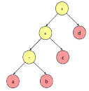
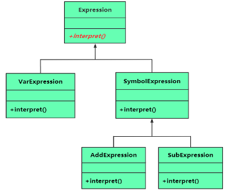
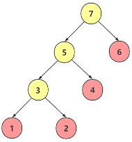
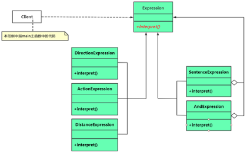

# 21 - 解释器模式

又叫做：解析器模式。是一种行为型模式，适合对一些简单的文法，规则结构进行分析、翻译。

但是实际上，复杂的解释器，还真不是用解释器模式工作的

## 1 - 一个用解释器模式编写的范例

一些变量，有个一个字母来表示变量：a、b、c、d，值希望在运行时指定。希望对这些变量进行加减法运算（不设计乘除法，考虑简单性）

比方说：7, 9, 3, 2，字符串 "a-b+c+d"，也就是 "7-9+3+2" = 3；
从左到右的解析。将这些规则表达为一个句子，然后构建解释器来解释这个句子，这就是解释器所做的事。

将这些规则表达为一个句子，实质就是：如果将计算规则表达为一个语法树（表达式树）

每一个节点，都可以分为两类：

1. 非终结符表达式（树枝）
2. 终结符表达式（树叶）

语法树中的每个节点所属的类，都会有一个叫做 interpret 的成员函数对本节点进行解释。

- 对于终结符表达式的节点，解释的时候：直接将变量名用实际的数字替换。
- 对于非终结符表达式的节点，运算

看`s1.cxx`，例子中的 UML 图如下：

接着，继续写：语法分析树的构建方法，看`s2.cxx`中的 analyse 函数。

调试一下，我可以看到节点的编号如图：

## 2 - 引入解释器(interpreter)模式

也就是，利用面向对象的语言，创建一个语法解释器。

定义：定义一个语言的文法（语法规则），并建立一个解释器解释该语言中的句子。
当一个语言需要解释执行 并且可以将该语言的句子解释为一个语法树的时候，就可以使用解释器模式

1. AbstractExpression（抽象表达式），也就是这里的 Expression 类
2. TerminalExpression（终结符表达式），也就是这里的 VarExpression 类，这些实例，可以通过 非终结符表达式组成更加复杂的句子
3. NonterminalExpression（非终结符表达式），也就是这里的 AddExpression、SubExpression
4. Context（环境类），可以存储表达式解释器的状态信息之类的，符号与值的映射

- 优点：良好的灵活性 和 可拓展性
- 缺点：适合实现 小而简单的文法：解释效率不会太高（会递归调用很多）；
  如果语法规则多，会产生大量的类，对于跟踪调试会产生诸多的不变。

## 3 - 机器人运动控制范例

规定机器人的行为规则：

1. 运动方向：上、下、左、右
2. 机器人的运动方式：行走（walk）、奔跑（run）
3. 机器人能够接受的终结符表达式有：运动方向、运动方式、运动距离（单位：米）
   比方说：left walk 5（向左行走 15 米）
   down run 20（向下奔跑 20 米）
4. 机器人能够接受的 非终结符表达式是 “句子”， 句子由：“运动方向 运动方式 运动距离”构成。
   不同的动作之间，可以通过 `and` 连接

看`s3.cxx`，下面是这个例子的 uml 类图

