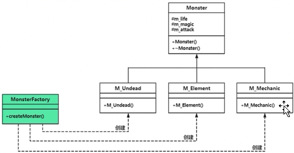
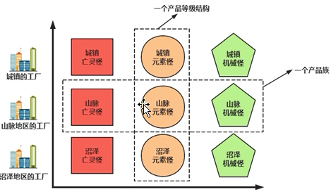

# chap3 - 工厂模式

new，创建堆对象，可以实现多态。
工厂模式：通过把创建对象的代码包装起来，做到创建对象的代码与具体的业务逻辑代码相隔离的目的

工厂模式细分：简单工厂模式、工厂方法模式、抽象工厂模式。

面向对象程序设计的一个重要原则：开闭原则。

## 简单工厂（simple factory）模式

并不算是一种严格的设计模式（一些书并不包含），但是用的挺多的。

比方说几种怪物：

策划：亡灵类怪物、元素类怪物、机械类怪物：都有生命值、魔法值、攻击力

Monster 作为父类：M_undead（亡灵类）、M_Element（元素类）、M_Mechanic（机械类怪物）

```cpp
class Monster {
public:
    Monster(int life, int magic, int attack)
        : m_attack(attack)
        , m_life(life)
        , m_magic(magic)
    {
    }
    virtual ~Monster() { }

protected:
    int m_attack;
    int m_life;
    int m_magic;
};

class M_Undead : public Monster {
public:
    M_Undead(int life, int magic, int attack)
        : Monster(life, magic, attack)
    {
        cout << "一个 👻 👻 👻 来到了这个世界" << endl;
    }
};

class M_Element : public Monster {
public:
    M_Element(int life, int magic, int attack)
        : Monster(life, magic, attack)
    {
        cout << "一个 ⚡️ ⚡️ ⚡️ 来到了这个世界" << endl;
    }
};

class M_Mechanic : public Monster {
public:
    M_Mechanic(int life, int magic, int attack)
        : Monster(life, magic, attack)
    {
        cout << "一个 🤖 🤖 🤖 来到了这个世界" << endl;
    }
};

int main(void)
{
    Monster* pM1 = new M_Undead(300, 50, 80);
    Monster* pM2 = new M_Element(200, 80, 100);
    Monster* pM3 = new M_Mechanic(400, 0, 110);

    delete pM1;
    delete pM2;
    delete pM3;
}
```

比方说，这里的`Monster* pM1 = new M_Undead(300, 50, 80);`这种方式创建对象就不好，
这就是：main 与 子类 紧耦合 的情况 ---> 毕竟我们需要知道类名。

以后，尽管我们的怪物增加了的话，这个 main 中创建对象就会膨胀。
我们想要创建对象的时候，不依赖于具体类名

`new + 具体类名`来创建对象是一种 依赖具体类型的紧耦合关系。
使用工厂类可以实现：创建怪物的代码 与 各个具体怪物类对象要实现的逻辑代码隔离

```cpp
/**
 * @brief 怪物工厂类
 *
 */
class MonsterFactory {
public:
    Monster* createMonster(string strmontype)
    // static Monster* createMonster(string strmontype)
    {
        Monster* ptrnobj = nullptr;
        // 笑了，c++的switch没有匹配字符串
        if (strmontype == "udd") { /* 代表创建亡灵类 */
            ptrnobj = new M_Undead(300, 50, 80);
        } else if (strmontype == "ele") {
            ptrnobj = new M_Element(200, 80, 100);
        } else if (strmontype == "mon") {
            ptrnobj = new M_Mechanic(400, 0, 110);
        }
        return ptrnobj;
    }
};

int main(void)
{
    MonsterFactory facobj;
    Monster* pM1 = facobj.createMonster("udd"); /* 创建了一个亡灵 */
    Monster* pM2 = facobj.createMonster("ele"); /* 创建了一个元素 */
    Monster* pM3 = facobj.createMonster("mon"); /* 创建了一个机械 */

    delete pM1;
    delete pM2;
    delete pM3;
}
```

封装变化：把依赖范围尽可能缩小，把容易变化的代码短限制在一个小范围内，
就可以在很大程序上提高代码的可维护性和可扩展性。

但是有缺点：就是以后如果有新类的话，我们需要增加新的 if-else 分支来达到支持新怪物（屎山代码）。
这实际上违背了 面向对象程序设计的原则：开闭原则（open close principle：OCP）

开闭原则：说的是代码的扩展性问题 —— 对扩展开放，对修改关闭（封闭）。
也就是：当增加新功能，不应该通过修改已经存在的代码来进行，
而是应该拓展代码（比方说增加新类，增加新函数）来进行。

如果 is-else 分支不多（没有几百个），那么适当的违反开闭原则，是完全可以接受的。

引入 “简单工厂” 设计模式的定义：定义一个工厂类(MonsterFactory)，
该类的成员函数（createMonster）可以根据不同参数创建并返回不同的类对象，
被创建的对象所属的类（M_Undead、M_Element、M_Mechanic）一般具有相同的父类(Monster)，
调用者无需关注实现的细节。

当然，还可以将`createMonster`设置为`static`，这个时候，就可以是`MonsterFactory::createMonster()`来创建对象，
这个就是：静态工厂模式

下面这个就是类图：



这里的 MonsterFactory 与其他三个类是：虚线箭头连接，
箭头表示依赖，虚线表示：在一个类中实例化出了另一个对象。

实现了怪物类 与 调用者耦合

## 工厂方法（factory method）模式

简称：工厂模式或者多态工厂模式。
上面的简单工厂模式，我们是创建了一个大的类，
专门用于创建对象的。

但是在 “工厂模式” 中，我们会对应的，给每个 Monster 写一个工厂类。

M_UndeadFactory、M_ElementFactory、M_MechanicFactory 类，
都有一个共同工的父类 M_ParFactory（工厂抽象类）。
符合开闭原则：对修改封闭，对扩展开放。
需要的代价是：需要新增多个新的工厂类。

```cpp
/**
 * @brief 父类，抽象类
 *
 */
class M_ParFactory {
public:
    virtual Monster* createMonster() = 0; /* 具体的实现在子类中进行 */
    virtual ~M_ParFactory() { } /* 做父类时，虚析构 */
};

/**
 * @brief 创建亡灵类怪物，怪物工厂
 *
 */
class M_UndeadFactory : public M_ParFactory {
public:
    virtual Monster* createMonster() override
    {
        return new M_Undead(300, 50, 80);
    }
};

/**
 * @brief 创建元素类怪物，怪物工厂
 *
 */
class M_ElementFactory : public M_ParFactory {
public:
    virtual Monster* createMonster() override
    {
        return new M_Element(100, 50, 80);
    }
};

/**
 * @brief 创建机械类怪物，怪物工厂
 *
 */
class M_MechanicFactory : public M_ParFactory {
public:
    virtual Monster* createMonster() override
    {
        return new M_Mechanic(350, 50, 80);
    }
};

/**
 * @brief 全局的，用于创建怪物对象的函数
 * 			这样，我所有的变化的部分，都只是在这个参数中体现了
 * @param factory 工厂父类型的指针
 * @return Monster* 怪物父类类型的指针
 */
Monster* Gbl_CreateMonster(M_ParFactory* factory)
{
    return factory->createMonster();
}

int main(void)
{
    /* 创建多态工厂 */
    M_ParFactory* p_eln_fy = new M_ElementFactory();
    /* 通过多态工厂创建怪物 */
    Monster* pM2 = Gbl_CreateMonster(p_eln_fy); /* 创建了一只元素类怪物 */

    /* 释放资源 */
    delete pM2;
    delete p_eln_fy;
    return 0;
}
```

定义：定义了一个用于创建对象的接口（M_ParFactory 类中的 createMonster 成员函数，这个成员函数就是工厂方法），
但由子类（M_UndeadFactory、M_ElementFactory、M_MechanicFactory）决定要实例化的类是哪一个。
该模式使得某个类（M_Undead、M_Element、M_Mechanic）的实例化延迟到了子类（M_UndeadFactory、M_ElementFactory、M_MechanicFactory）

出现新怪物类型：野兽类，我只需要：写一个野兽类 和 野兽类的工厂就可以了，不用修改现有的代码

```cpp
class M_Beast : public Monster {
public:
    M_Beast(int life, int magic, int attack)
        : Monster(life, magic, attack)
    {
        cout << "一只 🐒 🐒 🐒 来到了这个世界" << endl;
    }
};

class M_BeastFactory : public M_ParFactory {
public:
    virtual Monster* createMonster() override
    {
        return new M_Beast(350, 50, 80);
    }
};
```

工厂模式：把用 new 创建对象集中到了某个或者某些工厂类的成员函数中去做。 好处：

1. 封装变化：将依赖具体怪物的变化的范围缩小了。
2. 创建对象前需要一些额外的业务代码，可以将这些代码增加到 具体工厂类 的 createMonster 成员函数中

3. 小技巧：模板类

不想创建太多工厂类，但是又想封装变化。可以创建怪物工厂子类模板。

```cpp
template <typename T>
class M_ChildFactory : public M_ParFactory {
public:
    virtual Monster* createMonster() override
    {
        /* 但是这样就没法写出变化了 */
        return new T(300, 50, 80);
    }
};

int main(void) {
    /* 调用模板类 */
    M_ParFactory* p_udd_fy = new M_ChildFactory<M_Undead>;
    Monster* pM4 = p_udd_fy->createMonster();
}
```

小结：简单工厂模式把创建对象这件事放到了一个统一的地方未处理，弹性比较差。
而工厂方法模式相当于建立了一个程序实现框架，从而让子类决定对象该如何创建。

## 抽象工厂（abstract factory）模式

### 战斗场景分类范例

怪物分类：亡灵类、元素类、机械类

战斗场景：沼泽地区、山脉地区、城镇。

相应的，衍生出来了多种怪物：

- 亡灵：沼泽、山脉、城镇
- 山脉：沼泽、山脉、城镇
- 城镇：沼泽、山脉、城镇

工厂方法模式：一个工厂创建一种怪物。
但如果一个工厂子类能够创建不知一种，而是多种相同规则的怪物对象，
那么就可以有效的减少所创建的工厂子类。

两个概念：

1. 产品等级结构
2. 产品族



产品等级结构：同一个产品，这里也就是同一种怪物，
但是在不同的战斗场景，他们的属性值不同。一种怪物就是一个产品等级结构

产品族：战斗场景（比方说山脉），山脉会刷的一系列怪：
山脉的亡灵，山脉的元素、山脉的机械怪，这些怪物合在一起，就是产品族。

抽象工厂模式是按照产品族来生产产品的（产地相同的用一个工厂来生产），
一个地点有一个工厂，该工厂负责生产本产地的所有产品。

抽象工厂的优缺点：

1. 增加森林场景，怪物种类不变。则只需要增加一个新子工厂，比如 M_Factory_Forest，符合开闭原则。
2. 增加新怪物种类，那就比较麻烦了，需要给所有的场景都增加。而且还要针对 M_ParFactory 增加新的虚函数接口，比方说 createMonster_Dragon。
   这种修改代码的方式来增加新怪物中来，不符合开闭原则。
3. 如果只增加一个 产品族 则符合开闭原则，只需要增加新工厂子类，这是该模式的优点。
   但是如果增加 产品等级结构，需要修改抽象层代码，这是抽象工厂模式的缺点。因此：应避免在产品等级不稳定的情况下使用该模式。
   也就是说：如果游戏中怪物种类比较固定的情况下，更适合使用抽象工厂模式。

### 不同厂商生产不同部件范例

芭比娃娃：身体（头、颈部、躯干、四肢）、衣服、鞋子

中国、日本、美国 厂商

要求：制作两个芭比娃娃：

1. 身体、衣服、鞋子，全部都采用中国厂商制造的部件。
2. 身体采用中国厂商，衣服部件采用日本厂商，鞋子采用美国厂商。

类的设计思路：

1. 身体、衣服、鞋子 这三个部件实现为抽象类。

2. 实现一个抽象工厂，分别用来生产 身体、衣服、鞋子这三个部件。

3. 针对不同厂商的每个部件实现具体的类，以及每个厂商所代表的具体工厂
