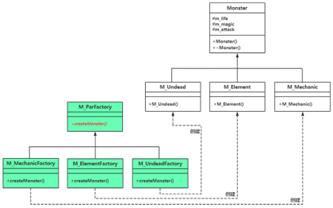
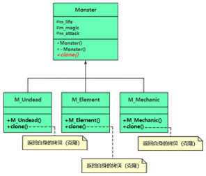

# chap3 - 原型（prototype）模式

原型模式：通过一个对象（原型对象）克隆出多个一模一样的对象。

## 1 - 通过工厂方法模式演变到原型模式

回顾一下 工厂方法模式的 UML 图



原型模式就是：将 工厂父类 与 Monster 父类合并，
能够自己进行克隆

克隆对象自身实际上是需要调用类的拷贝构造函数。
克隆对象意味着复制出一个全新的对象，所以涉及到深浅拷贝时都要实现深拷贝。

## 2 - 引入原型模式（prototype）

定义：用原型实例指定创建对象的种类， 并且通过拷贝这些原型创建新的对象。 简单来说就是通过克隆来创建新的对象实例。

原型模式的两种角色：

1. 抽象原型类(prototype)：Monster 类

2. concretePrototype（具体原型类）：M_Undead、M_Element、M_Mechanic 类

比方说：一个 boss，他自身数据比较复杂，在低于一定血量之后，会进行克隆。
使用工厂方法创建这种：血量、魔法值都在随时变化的对象，这比较复杂。

总结来说：如果对象内部数据比较复杂多变，并且在创建对象的时候希望保持对象的当前状态，
那么用原型模式显然比用工厂方法模式更合适。

工厂方法模式和原型模式在创建对象时的异同点：

1. 都不需要程序员知道创建对象所属的类名
2. 工厂方法模式中的 createMonster 仍旧属于根据类名来生成新对象
3. 原型模式中的 clone 是根据现有对象来生成新对象



原型模式优缺点：

1. 如果创建的新对象内部数据比较复杂且多变，原型模式创建对象的效率可能会高很多
2. 原型模式不存在额外的登记结构 —— 原型模式不需要额外的工厂类

如果我不引入 clone，那么我要如何 clone 呢？（反面教材，哈哈哈）

```cpp
void Gbl_CreateMonster(Monster* pMonster)
{
    Monster* ptmpobj = nullptr;
    if (dynamic_cast<M_Undead*>(pMonster) != nullptr) {
        ptmpobj = new M_Undead(300, 50, 80);
    } else if (dynamic_cast<M_Element*>(pMonster) != nullptr) {
        ptmpobj = new M_Element(300, 50, 80);
    } else if (dynamic_cast<M_Mechanic*>(pMonster) != nullptr) {
        ptmpobj = new M_Element(300, 50, 80);
    }

    if (ptmpobj != nullptr) {
        // do something
    }
}
```

但是如果我引入了 原型模式，那么我直接这样就可以了

```cpp
void Gbl_CreateMonster(Monster* pMonster)
{
    Monster* ptmpobj = pMonster.clone();;

    if (ptmpobj != nullptr) {
        // do something
    }
}
```
