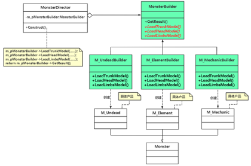
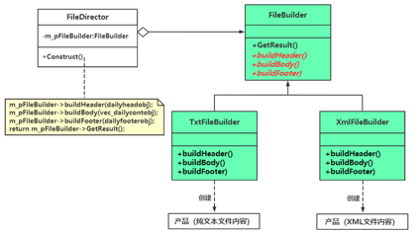

# chap3 - 建造者（builder）模式

与工厂模式、原型模式类似，也是用来创建东西的。
通常用于创建比较复杂的对象。

## 1 - 一个具体实现范例的逐步重构

创建怪物：亡灵类，元素类，机械类。

怪物组成：头部、驱赶（颈部、尾巴）、肢体，三个部位组成。
这样拆分开来，是为了能够 同类怪物之间的部位可以互换。

编码步骤：将怪物躯干模型信息读入内存。
将怪物的头部和四肢模型信息读入内存。
将头部和四肢模型以正确的位置和方向挂接到驱赶部位。

```cpp
class Monster {
public:
    virtual ~Monster() { } /* 做父类时析构函数应该为虚函数 */
    void Assemble(string strModelNo) /* 参数：模型编号 */
    {
        /* 载入躯干模型。截取字符，从第4个开始，截取3个字符 */
        LoadTrunkMode(strModelNo.substr(4, 3));

        /* 载入头部模型。并挂接到躯干模型上 */
        LoadHeadMode(strModelNo.substr(7, 3));

        /* 载入四肢模型。并挂接到躯干模型上 */
        LoadLimbsMode(strModelNo.substr(10, 3));
    }

    virtual void LoadTrunkMode(string strNo) = 0; /* 驱干 */
    virtual void LoadHeadMode(string strNo) = 0; /* 头 */
    virtual void LoadLimbsMode(string strNo) = 0; /* 四肢 */
};
```

不能把 Assemble 放到构造函数中，回看 chap0-1：不能在 构造函数、析构函数中调用虚函数。

这个确实有点像：模板方法模式。

Assemble、LoadTrunkModel、LoadHeadModel、LoadLimbsModel

解决方法：引入与怪物类同层次的相关构建器类，把怪物类中代码搬到相关的构建器类中。

## 2 - 引入建造者（builder）模式

定义：将一个复杂对象的构建与他的表示分离，使同样的构建过程可以创建不同的表示。

MonsterBuilder 类就是对象的构建，Monster 类就是对象表示。

构建表示，main 函数中的

```cpp
MonsterBuilder* pMonsterBuilder = new M_UndeadBuilder(); // 创建亡灵类构建器
MonsterDirector* pDirector = new MonsterDirector(pMonsterBuilder);
Monster* pMonster = pDirector->Construct("1234567890987654321");
```

其中，这里的 COnstruct 是稳定的，不会发生变化。
下面是 UML 图：



建造者模式包含的 4 中角色：

1. builder（抽象构建器）为创建一个产品对象的各个部件，指定抽象接口；同时也会指定一个 GetResult 接口，用于返回所创建的复杂对象。这里指 MonsterBuilder
2. ConcreteBuilder（具体构建器）也就是这里的 M_deadBuilder 之类的，实现了 builder 中的抽象接口。实现了产品各个部件的构造，定义并明确了其所创建的复杂对象
3. product（产品）指的是被构建的复杂对象，其中这个复杂对象包含多个部件。由具体构建器创建该产品的内部表示，并定义他的装配过程。这里指 M_Undead
4. Director（指挥者）内涵有指向抽象构建器的指针，利用这个指针调用构建器中的装配方法 LoadTrunkModel 等，来完成复杂对象的构建工作

当然这个 Director 可以与 builder 合并。
但是如果 concreteBuilder 中需要重写的接口就已经很多了，还是建议把控制流程（Director）单独拆开。
总结：复杂的东西就考虑拆解，简单的东西就考虑合并。

## 3 - 另一个建造者模式的范例

各部门员工 工作日报包含：标题、内容主体、结尾 三部分。

1. 标题部分：部门名称、日报生成日期等

2. 内容主体：具体描述可能有多条（一天可能做了多项工作）

3. 结尾：姓名

将日报导出成多种格式的文件，比如纯文本、XML 格式、JSON 格式。

导出到文件三个步骤不变：

1. 拼接标题
2. 拼接内容主体
3. 拼接结尾

考虑将这三个步骤（复杂对象的构建过程）抽象出来，形成一个通用的处理过程。

建造者模式的初衷：讲构建不同格式数据的细节实现代码与 具体的构建步骤 分离，达到复用构建步骤的目的。

### 不用设计模式时程序应该如何书写

这个具体可以参考`s1_4.cc`

### 采用设计模式时程序应该如何书写

这个具体可以参考`s1_5.cc`



## 4 - 建造者模式的总结

用于分步骤构建一个复杂对象，其中构建步骤是一个稳定算法（忽然想到 post 报头）。

何时使用：

1. 产品对象内部结构复杂，产品往往由多个零件组成
2. 需要创建的产品对象内部属性互相依赖，需要指定创建次序
3. 当创建复杂对象的步骤（过程）应该独立于该对象的组成部分
4. 将复杂对象的创建和使用分离，使相同的创建过程可以创建不同的产品

指挥者类作用：

1. 通过部件以指定顺序来构建整个产品（控制了构建过程）
2. 通过提供 Construct 接口隔离了客户端与具体构建过程 所必须要调用的类的成员函数 关联

建造者模式优点：

1. 产品构建和产品表现上的分离。构建算法可以被复用
2. 向客户端隐藏了产品内部的表现
3. 产品的实现可以被 随时随意 的替换

建造者模式缺点：

1. 要求所创建的产品有比较多的共同点，创建步骤（组成部分）要大致相同
2. 建造者模式涉及到很多类，Director、builder 对象。
