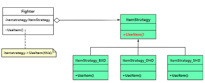

# chap4 - 策略模式

## 1 - 一个具体实现范例的逐步重构

玩家到达一个特定的场景 或者 击杀 boss，那么补血道具将会出现。

补血道具（药品）：

1. 补血丹：补充 200 点生命值
2. 大还丹：补充 300 点生命值
3. 守护丹：补充 500 点生命值

Fighter: F_Warrior, F_Mage

上面这段代码有两个问题：

1. 如果增加了补血道具，那么需要修改 UseItem，不满足开闭原则
2. 如果怪物也能吃 补血道具，然而我们这里的 UseItem 是写在 Fighter 中的
3. 甚至我希望，同一种道具，可以对于不同的角色，可以实现不同的功能

我们可以将：每一个 switch 分支，创建一个 class

策略模式的定义：定义一系列算法（策略类），将每个算法封装起来，
让他们可以相互替换。换句话说，策略模式通常把一系列算法封装到一系列具体策略类中来作为抽象策略类的子类，
然后根据实际需要使用这些子类



策略类中的三种角色：

1. context（环境类）：该类中维持着一个对抽象策略类的指针 或者 引用`ItemStrategy* itemStrategy = nullptr;`。这里的 context 也就是 Fighter 类
2. strategy（抽象策略类）：定义所支持的算法的公共接口，是所有策略类的父类。这里指 ItemStrategy 类。
3. ConcreteStrategy（具体策略类）：抽象策略类的子类，实现抽象策略类中声明的接口`virtual void UseItem(Fighter* mainobj) = 0;`。
   本例中指的是 ItemStrategy_BXD 等

策略模式的优势：

1. 以拓展的方式支持对未来的变化，符合开闭原则。（比方说 if-else 的分支、或者是 switch 的分支大量不稳定，那么可以使用策略模式）
2. 算法可以被复用（比方说这里的 吃大还丹，主角可以使用、怪物也可以使用）
3. 策略模式可以看成是 类继承 的一种 替代方案。通过为环境类对象 执行不同的策略，就可以改变环境类对象的行为。
   就是我如果不使用策略模式，我可以继承-多态，但是这样其实破坏了 is-a 关系。

策略模式的缺点：

1. 导致引入许多新的策略类
2. 使用策略时，调用者(main 主函数)必须熟知所有策略类的功能，并根据实际需要决定使用哪个策略类。

## 2 - 依赖倒置原则（dependency inversion principle，DIP）

是面向对象设计的主要实现方法，同时也是实现开闭原则的 重要实现途径。

解释：高层组建不应该依赖于底层（具体实现类），两者都应该依赖于抽象层。

范例：工厂模式时，亡灵类 M_Undead、元素类 M_Element、机械类 M_Mechanic。

如果我有这种函数`warrior_attack_Undead`（这个函数可以修改怪物属性），每当有新的怪物类增加的时候，
那么相应的 fighter 类也会相应的改变，这肯定是有问题的。

我们可以，让 undead 依赖抽象，也就是`class M_undead : public Monster`。


比方说像这里的

```cpp
void attack(Monster* ptmp) {
	// do sth.
}
```

或者是像上面的：

```cpp
void Fighter::SetItemStrategy(ItemStrategy* strategy) {
	itermStrategy = strategy;
}
```

这里的`Fighter`是面向`ItemStrategy`（抽象类）变成。
这种就是依赖倒置原则。
