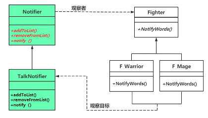

# chap5 - 观察者模式

程序设计中，有的时候，需要为对象建立一种通知依赖关系。
当该对象的状态发生变化的时候，通过公告或者广播的方式，通知一系列相关的对象，实现对象之间的联动。

但是这种联动，又会造成一系列的对象之间的特别紧密的耦合关系。

观察者模式是一种 使用频率比较高的 行为级设计模式，
可以将这种一对多的依赖关系进行弱化，实现对象之间关系的松耦合。

## 1 - 一个遍历问题导致的低效率范例

游戏公司为了创收，将单机游戏改成 多人网游。这样主角就变多了。

玩家可以组成 20 人以下的家族，家族之间可以开战获取利益。

家族成员之间的聊天信息，可以被家族中其他成员看到。
当然，家族其他成员有权屏蔽家族的聊天信息。

非本家族的成员，是看不到本家族的聊天信息的。

家族 id 和 玩家 id 在实际游戏中，应该会保存在数据库中，我们这里用 vector 来搞

看`s1.cxx`，这种效率并不高，因为：

```cxx
void SayWords(string tmpContent) // 玩家说了某句话
{
	if (this->m_iFamilyID != -1) {
		// 该玩家属于某个家族，应该把聊天信息传送给家族的其他玩家
		for (auto iter : g_playerList) {
			if (this->m_iFamilyID == iter->m_iFamilyID) {
				// 同一个家族的其他玩家也应该收到聊天信息
				NotifyWords(iter, tmpContent);
			}
		}
	}
}
```

这个要遍历所有玩家，而且每说一句话，就要进行一次遍历，这肯定有问题。

所以我们可以每个家族开一个链表，每个家族最多是 20 人，就不用太多遍历了。

## 2 - 引入观察者（Observer）模式

可以看`s2.cxx`

观察者是被动的得到通知，而不是主动去观察的。

玩家说话，传入通知器，通知器通知其他玩家。

定义：对象间（notifier 与 fighter）的一种 一对多的依赖关系（一个通知器对应多个玩家），当一个对象的状态发生改变时（被传到通知器中），
当一个对象的状态发生改变时，所有依赖于他的对象都会自动得到通知。

十字路口红绿灯，行人是观察者，红绿灯是观察目标，但是其实是一种通知关系的。
然后国外的，如果确实没车了，可以按一个按钮来着。



fighter 依赖 notifier，传参`void Fighter::SayWords(string tmpContent, Notifier* notifier)`；

notifier 依赖 fighter：

```cxx
    // 家族中，某玩家说了句话，调用该函数来通知家族中所有人
    virtual void notify(Fighter* talker, string tmpContent)
    {
        int tmpFamilyID = talker->GetFamilyID();
        if (tmpFamilyID != -1) {
            auto iter = m_familyList.find(tmpFamilyID);
            if (iter != m_familyList.end()) {
                for (auto iter : m_familyList[tmpFamilyID]) {
                    // 同一个家族的其他玩家也应该收到聊天信息
                    iter->NotifyWords(talker, tmpContent);
                }
            }
        }
    }
```

其中`iter->NotifyWords(talker, tmpContent)`就是：观察者收到通知以后，要进行的操作

观察者模式也叫做：发布-订阅（publish-subscribe）模式。

4 种角色：

1. subject（主体）：观察目标，这里指 Notifier 类（抽象类）
2. ConcreteSubject（具体主题）：这里指的是 TalkNotifier 类
3. Observer（观察者）：这里指 Fighter 类
4. ConcreteObserver（具体观察者）：这里指 F_Warrior 和 F_Mage 子类。

观察者模式的特点：

1. 观察者和观察目标之间，建立了松耦合，观察者目标只用维持一个抽象的观察者列表，
   并不需要了解具体的观察者类，改变观察者和观察目标的一方，只要调用接口不发生改变，就不会影响另一方。
   松耦合的双方，都只需要依赖于抽象，但是不依赖于具体类
2. 观察目标会向观察者列表中的所有观察者发送通知
3. 可以通过增加代码来增加新的观察者或者观察目标，符合开闭原则。

## 3 - 应用联想

数据展示：饼图、柱状图

逆战中，挑战模式的机械，自动攻击怪物。
一定范围内，加入链表。
