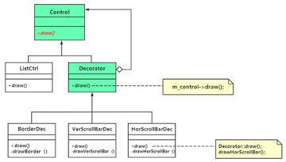

# chap6 - 装饰模式

装饰器模式/包装模式，是一种结构型模式

## 1 - 问题的提出

UI（user interface）界面。

比方说像功夫派的背包，右侧会有滚动条，如果背包中的东西太多的话。

先后为一个普通的列表控件，增加边框、垂直滚动条、水平滚动条。

1. ListCtrl 类代表普通列表控件，提供 draw 方法
2. BorderListCtrl 类，继承自 ListCtrl，用于表示：增加了边框的列表控件，提供 draw 方法
3. VerScBorderListCtrl 类，继承自 BoarderListCtrl，用于表示：增加了边框和垂直滚动条的列表控件，提供 draw 方法
4. HorScVerScBorderListCtrl 类，继承自 VerScBorderListCtrl，用于表示：增加了边框、垂直滚动条、水平滚动条的列表空间，提供 draw 方法

（为什么要创建新的类？为的是：开闭原则）

就是如果我一组合，就要新增加一个类，这就导致类的数量泛滥，而且灵活性也差。

所以采用继承机制，来解决：列表控件的绘制问题，肯定不是一个好的解决方案

继承 改为 组装方式来解决，防止类泛滥。

1. ListCtrl 类表示普通列表控件，提供 draw 方法
2. 增加边框 ---> 带边框的列表控件
3. 增加垂直滚动条 ---> 带垂直滚动条的列表控件
4. 再给这个带垂直滚动条的列表控件增加一个水平滚动条 ---> 既带边框又带水平垂直滚动条的列表控件

这种通过装饰方式，将一个类的功能不断增强的思想（动态的增加新功能），
就是装饰模式的设计核心思想

## 2 - 引入装饰（decorator）模式

组合复用原则（composite reuse principle, crp），也称为合成复用原则/聚合复用原则。

若两个使用继承进行设计，则父类代码的修改可能影响子类的行为，而且可能父类的很多方法子类是用不上的，
这显然是一种浪费。

若使用组合进行设计，则可以大大降低两个类之间的依赖关系，也不会存在因为继承惯性导致的浪费行为，
所以：如果继承和组合都能达到设计目的，优先考虑使用组合（组合优于继承）

装饰器不要单纯的理解为是：装饰器。其实是经过包装以后的新控件，和原本的控件本质上是一样的。

```cpp
// 抽象装饰器类
class Decorator : public Control { /* 继承关系 */
public:
    Decorator(Control* tmpCtrl)
        : m_control(tmpCtrl)
    {
    }

    virtual void draw() override
    {
        m_control->draw();
    }

private:
    Control* m_control; /* 委托关系（组合关系） */
};
```

下面就是要绘制具体的装饰器类

```cpp
/**
 * @brief 边框装饰器类
 *
 */
class BorderDec : public Decorator {
public:
    BorderDec(Control* tmpCtrl)
        : Decorator(tmpCtrl)
    {
    }

    virtual void draw() override
    {
        Decorator::draw(); /* 调用父类的 draw，这个是装饰模式的典型写法，保持以往已经绘制出的内容 */
        drawBorder(); // 也要绘制自己的内容
    }

private:
    void drawBorder()
    {
        cout << "绘制边框!" << endl;
    }
};
```

注意一下这个 drawBoarder 是放到了 Decorator::draw 的后面，其实这里是相当于是一个：后序遍历了

下面是使用装饰器：

```cpp
int main(void)
{
    // (1) 首先绘制普通的列表控件
    Control* pListCtrl = new ListCtrl;

    // (2) 接着，借助普通的列表控件，可以通过边框装饰器绘制出一个 带边框的列表控件
    Decorator* pListCtrl_b = new BorderDec(pListCtrl);

    // (3) 然后，绘制出一个 带边框、垂直滚动条的列表控件
    Decorator* pListCtrl_b_v = new VerScrollBarDec(pListCtrl_b);
    pListCtrl_b_v->draw();

    cout << "----------" << endl;

    // (4) 最后，绘制出一个 水平滚动条的列表控件
    Decorator* pListCtrl_b_v_h = new HorScrollBarDec(pListCtrl_b_v);
    pListCtrl_b_v_h->draw();

	/* 释放资源，略 */
    return 0;
}
```

下面是这个例子的 uml 图



装饰器设计模式的定义：动态的给一个对象添加一些额外的职责。
就添加功能来说，该模式相比生成子类更加灵活

装饰器模式的四种角色：

1. Control（抽象构建）：draw 接口，让调用这以一致的方式处理未被修饰的对象，以及经过修饰之后的对象，实现客户端的透明操作
2. ListControl（具体构建）：实现抽象构建定义的接口。此后，装饰器就可以给该构建增加额外的方法（职责）
3. Decorator（抽象装饰器类）：
4. BorderDec、VerScrollBarDec、HorScrollBarDec（具体装饰器类），
   每个具体装饰器类都增加了一些新方法，而后通过 Decorator::draw() 调用，达到最终的修饰目的。

优缺点：

1. 比继承更灵活，符合开闭原则。开闭原则往往应该用在最有可能改变的地方
2. 装饰器，对象有相同的父类，装饰器就可以取代一个对象，组合使对象得到新能力
3. 会产生一些小对象

## 3 - 另一个装饰模式的范例 - 计算水果饮料最终价格

1. 一杯单纯的水果饮料，售价 10 块钱
2. 砂糖，1 块钱
3. 牛奶，2 元
4. 珍珠，2 元
