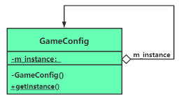

# chap7 - 单件模式

创建型模式，创建只能产生一个对象实例的类 —— 用私有构造函数实现类的定义

## 1 - 单件类的基本概念和实现

比方说游戏中的配置选项，GameConfig，像这种配置选项，有且只有一个。

只能创建一个对象：文件系统、配置系统、线程池。

scott meyers: 要使接口或者类型易于正确使用，难以错误使用。

虽然我们可以在文档中直接说明，只创建一个对象。
但是要满足 scott meyers 说的话，就应该从源头上，直接制止创建多个类。

看 `s1.cxx`

## 2 - 单件类在多线程中可能导致的问题

如果多个线程同时 getInstance，这很有可能导致 `m_instance = new GameConfig()` 被多次执行

加锁(但是其实感觉可以 cas)

### 上一把大锁

不应该采用，解决效率低。
这个会影响正常的使用，每次 getInstance 都要上锁，这严重影响了执行效率，
毕竟`m_instace == nullptr`只是少数情况。

```cxx
    static GameConfig* getInstance()
    {
        if (m_instance == nullptr) {
            m_instance = new GameConfig();
        }
        return m_instance;
    }
```

### 双重检查锁定

```cxx
    static GameConfig* getInstance()
    {
        if (m_instance == nullptr) { // 这个时候，可能有多个线程都通过了
            lock_guard<mutex> gcguard(my_mutex);
            if (m_instance == nullptr) {  // 走到这里，只有一个线程满足
                m_instance = new GameConfig();
            }
        }
        return m_instance;
    }
```

平常的调用 getInstance 都不会执行到 加锁的代码。

但是 双重锁定还是有潜在问题：内存访问重新排序（重新排列编译器生成的汇编指令），导致双重锁定失效问题。

可以设置内存屏障

```cxx
static Singleton* getInstance() {
        Singleton* tmp = instance.load(std::memory_order_acquire);
        if (tmp == nullptr) {
            std::lock_guard<std::mutex> lock(mutex);
            tmp = instance.load(std::memory_order_relaxed);
            if (tmp == nullptr) {
                tmp = new Singleton;
                // Before C++11, we would have used a memory barrier here
                instance.store(tmp, std::memory_order_release);
            }
        }
        return tmp;
    }
```

一个好的解决多线程创建 GameConfig 类对象问题的方法是在 main 主函数中，在创建任何其他线程之前，
先执行一次 GameConfig::getInstance()；来把这个单独的 GameConfig 对象创建出来（有点像饿汉模式）

## 3 - 饿汉模式 与 懒汉模式

### 饿汉模式

饿汉模式：初始化静态变量的时候，并不是赋值为`nullptr`，而是直接创建静态对象。
在 main 之前就已经有了 静态对象了。

不管是否调用了 getInstance 成员函数，这个单例类就已经被创建了（对象创建不受到多线程问题困扰）

看`s3.cxx`，但是有一个问题，就是多个`.cxx`文件，如果有全局变量`int g_test = GameConfig::getInstance()->m_i`，
这种代码其实是不安全的，因为不确定初始化顺序。

### 懒汉模式

如果单例类比较大的话，饿汉一开始就会占用很多资源，这比较麻烦。
我们可以后面再创建，但是懒汉模式会受到多线程的困扰。

## 4 - 单件类对象内存释放问题

单例类对象的生命周期，一般是贯穿整个程序的，
当整个程序结束的时候，所占用的内存可以直接由操作系统回收。
但是主动的回收资源是一种好习惯。

笨方法：写一个成员函数，手动的释放

```cpp
    static void freeInstance()
    {
        if (m_instance != nullptr) {
            delete GameConfig::m_instance;
            GameConfig::m_instance = nullptr;
        }
    }
```

### 写一个垃圾回收类（饿汉模式）

```cxx
class GameConfig {
private:
    GameConfig();
    GameConfig(const GameConfig& tmpobj);
    GameConfig& operator=(const GameConfig& tmpobj);
    ~GameConfig();

public:
    static GameConfig* getInstance()
    {
        return m_instance;
    }

private:
    /**
     * @brief 释放单例类引入的 GameConfig 类中的 嵌套类（垃圾回收） ++
     *
     */
    class Garbo {
    public:
        ~Garbo()
        {
            if (GameConfig::m_instance != nullptr) {
                delete GameConfig::m_instance;
                GameConfig::m_instance = nullptr;
            }
        }
    };

private:
    static GameConfig* m_instance; /* 指向本类对象的指针 */
    static Garbo garboObj; // ++
};

/* 编译时 创建对象 */
GameConfig* GameConfig::m_instance = new GameConfig();
GameConfig::Garbo GameConfig::garboObj;
```

### 垃圾回收，饿汉模式

```cxx
class GameConfig {
private:
    GameConfig();
    GameConfig(const GameConfig& tmpobj);
    GameConfig& operator=(const GameConfig& tmpobj);
    ~GameConfig();

public:
    static GameConfig* getInstance()
    {
        // 有问题
        if (m_instance == nullptr) {
            static Garbo garboObj;
            m_instance = new GameConfig();
        }
        return m_instance;
    }

private:
    class Garbo {
    public:
        ~Garbo()
        {
            if (GameConfig::m_instance != nullptr) {
                delete GameConfig::m_instance;
                GameConfig::m_instance = nullptr;
            }
        }
    };

private:
    static GameConfig* m_instance; /* 指向本类对象的指针 */
};
```

## 5 - 单件类定义、UML 图

定义：保证一个类仅有一个实例存在，同时提供能对该实例访问的全局方法（getInstance 成员函数）

UML 类图



这里的，带下划线的东西，表示：静态成员。

不过这个单例类并不需要 继承之类的。

## 6 - 单例模式的另外一种实现方式

```cxx
class GameConfig {
private:
    GameConfig();
    GameConfig(const GameConfig& tmpobj);
    GameConfig& operator=(const GameConfig& tmpobj);
    ~GameConfig();

public:
    static GameConfig* getInstance()
    {
        return &m_instance;
    }

private:
    static GameConfig m_instance;
};

/* 饿汉模式 */
GameConfig GameConfig::m_instance;
```

这里不会出现：类无限递归，导致类的大小不确定的问题。
因为 静态成员变量 并不属于创建的对象，而是属于类本身，sizeof() 不会有静态变量的大小的。

## 7 - 另一种实现方式

```cxx
class GameConfig {
private:
    GameConfig();
    GameConfig(const GameConfig& tmpobj);
    GameConfig& operator=(const GameConfig& tmpobj);
    ~GameConfig();

public:
    static GameConfig& getInstance() /* 返回局部静态变量的引用 */
    {
        static GameConfig instance;
        return instance;
    }
};
```

注意区分：1. 函数第一次执行时被初始化的静态变量 与 2. 通过编译期常量进行初始化的基本类型静态变量

我们这里的`getInstance`就属于 第一种 了，因此也是存在多线程问题的。

第二种 的例子：

```cxx
int myfunc() {
	static int stcs = 100; /* 这个而在编译期间就已经决定了 */
	stcs += 180;
	return stcs;
}
```

多个单间类之间的相互引用问题，
比方说都是 懒汉模式 Log GameConfig，
这两个单例类的析构顺序是不一致的，
这是要注意的。那么可能调用已经释放了的对象。
因此：不要在单例类的析构函数中调用其他单例类对象。
