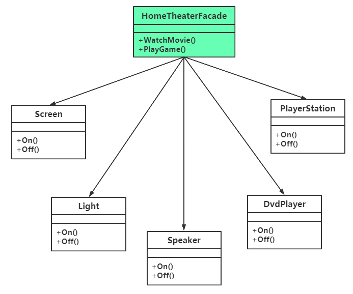

# chap8 - 外观模式

外观模式，也被称为：门面模式，也是一种结构型模式。
目的：隔离接口 —— 中间层角色。有点像 依赖倒置原则：高层、地层都依赖于 抽象层。

迪米特法则

## 1 - 一个配置相关的范例

魔兽世界，设置有很多：图形方面（特效、细节、分辨率、抗锯齿）；声音方面（音量大小设置、环境声音、音乐）；语音聊天（聊天音量、麦克风的灵敏度）

这里的配置，采用单例类。

可以看到，在`s1.cxx`文件中，有 3 个单件类。但是单件类中，
有一些代码是冗余的，比方说同样的单件类的配方，可以使用单件类模板。

## 2 - 引入外观（facade）模式

把 graphic、sound、chatvoice —— 业务类。
在 main 中调用业务类代码，把这些代码称之为 客户端代码。

可以设置一个：conffacade，隔在 客户端代码 与 业务类 之间。

外观模式，强调的是一种程序设计思想。

conffacade 中提供两种接口，一种是适合给低配置电脑客户端使用，一种是适合该高配置电脑客户端使用。

体现了：迪米特法则(law of demeter, LoD)，或者也叫 最小知识原则（least konwledge principle, LKP）

一个对象应该对其他对象尽可能少的了解，从而降低各个对象之间的耦合，提高系统可维护性。

```cxx
class conffacade {
    // ---------- 单例模式相关 begin ----------
private:
    conffacade() {};
    conffacade(const graphic& tmpobj) { }
    conffacade& operator=(const graphic& tmpobj) { }
    ~conffacade() { }
    // ---------- 单例模式相关 end ----------

public:
    static conffacade& getInstance()
    {
        static conffacade instance;
        return instance;
    }

public:
    void LowConfComputer()
    {
        graphic& g_gp = graphic::getInstance();
        g_gp.display(true);
        g_gp.effect(false);
        g_gp.resolution(2);
        g_gp.antialiasing(false);

        sound& g_snd = sound::getInstance();
        g_snd.bgsound(false);
        g_snd.envirsound(false);
        g_snd.expsound(false);
        g_snd.setvolume(15);

        chatvoice& g_cv = chatvoice::getInstance();
        g_cv.chatvolume(20);
        g_cv.micsens(50);
        g_cv.chatvolume(60);
    }

    /**
     * @brief 高配电脑，能达到最好效果项，全部开启
     *
     */
    void HighConfComputer()
    {
        graphic& g_gp = graphic::getInstance();
        g_gp.display(false);
        g_gp.effect(true);
        g_gp.resolution(0);
        g_gp.antialiasing(true);

        sound& g_snd = sound::getInstance();
        g_snd.bgsound(false);
        g_snd.envirsound(false);
        g_snd.expsound(false);
        g_snd.setvolume(15);

        chatvoice& g_cv = chatvoice::getInstance();
        g_cv.chatvolume(20);
        g_cv.micsens(50);
        g_cv.chatvolume(60);
    }
};

int main(void)
{
    conffacade& g_cffde = conffacade::getInstance();
    cout << " ---------- 低配电脑 ---------- " << endl;
    g_cffde.LowConfComputer();

    cout << " ---------- 高配电脑 ---------- " << endl;
    g_cffde.HighConfComputer();
}
```

这样，客户端只用与 conffacade 打交道，就不用与 具体业务类打交道。

外观模式包含 2 中角色：

1. facade 外观角色：客户端可以调用该角色的成员方法
2. subsystem（子系统角色），也就是这里的 业务类。子系统可以是一个类，
   也可以是彼此耦合的类

并不是一定：有了外观类就不能引用 业务类了。

外观设计模式的定义：提供了统一的接口，用来访问子系统中的一群接口。
外观提供了一个高层接口，使子系统更容易使用。

外观模式并没有一个具体的 UML 图。

如果客户端觉得 外观类 不灵活，也可以直接调用子系统。

外观模式为客户端和子系统之间提供了一种简化交互渠道，但是没有为子系统增加新的行为。
如果希望增加新行为，应该通过修改子系统来使用

生活中的外观模式：

比方说自己炒菜，与到饭馆吃饭。厨师就提供了一种外观模式的角色。
直接投资，与购买基金相比，投资公司就扮演了外观模式的角色。

## 3 - 另一个外观模式的范例

家庭影院外观模式类：HomeTheaterFacade，电器设备关联

1. 设备：Screen、light、dvdplayer、playStation
2. 看电影模式 WatchMoive：屏幕打开，灯光熄灭，音响打开，dvd 打开，游戏机关闭
3. 玩游戏模式 PlayGame：屏幕打开，灯光打开，音响打开，dvd 关闭，游戏机打开


