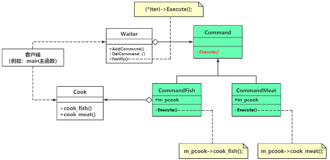

# chap9 - 命令模式

是一种行为型模式

## 1 - 通过一个范例 引出 命令模式 代码编写的方法

来到了一个饭馆，点了两个菜：红烧鱼、锅包肉。

如果我的饭馆只有厨师，厨师实际上记不住太多客户报的菜，
因此需要一位服务员。

```cxx
/**
 * @brief 做锅包肉菜品的命令
 *
 */
class CommandMeat : public Command {
public:
    CommandMeat(Cook* pcook)
        : Command(pcook)
    {
    }

    virtual void Execute() override
    {
        m_pcook->cook_meat();
    }
};
```

对应的感觉就是：将成员函数，封装成了一个类。
封装成了一个类，类可以创建对象，
那么就对应的可以将对象作为参数传递。

```cxx
int main(void)
{
	Cook* pcook = new Cook();

    // 有一种创建一个 便签的感觉，并且这个便签还指定了是哪一个厨师
    Command* pcmd1 = new CommandFish(pcook);
    pcmd1->Execute();
}
```

但是这有个问题：如果我要点 10 个菜品，那么岂不是要 new 10 个这个 Command 对象？
实际上，我只需要在 一个便签上 写 10 个菜 就行了。并且我将这个便签给 +服务员+，看`s3.cxx`

但是`s3.cxx`还是有问题，一张便签上没法写多个菜品，服务员想要搜集多个顾客的东西，
这样就可以让厨师一次做多个菜

## 2 - 引入命令（command）模式



5 种 角色：

1. receiver（接收者类）：知道如何实施与执行一个请求的相关操作的类，比方说这里的 Cooker
2. Invoker（调用者类）：请求的发送者，通过命令对象来执行请求`Command->Execute()`，比方说这里的 Waiter
3. Command（抽象命令类）：声明执行操作的接口`Execute`，`virtual void Execute = 0;`，组合有 receiver 的指针
4. ConcreteCommand（具体命令类）：CommandFish 类 和 CommandMeat 类
5. Client（客户端）：创建命令对象、调用者对象、接收者对象。将命令对象传给调用者对象。

定义：将一个请求或者命令封装为一个对象，以便这些请求可以以对象的方式通过参数进行传递，
对象化了的请求还可以排队执行，或者根据需要将这些请求录入日志公查看和排错，以及支持请求执行后的可撤销操作。

能力：对请求进行封装，命令对象将动作和接收者包裹到了对象中，并且只暴露了一个 execute 方法，让接收者执行动作

## 3 - 命令模式用途研究

有一种疑惑：过度设计。

用途：异步执行、延迟执行、撤销、执行过程中增加日志记录等，是命令模式的主要应用场景。

### 改造范例增加对象使用时的独立性

1. 减少代码的 多行耦合

```cxx
class Command {
public:
    Command(Cook* pcook)
    {
        m_pcook = pcook;
    }
    virtual ~Command()
    {
        if (m_pcook != nullptr) {
            delete m_pcook;
            m_pcook = nullptr;
        }
    }
    virtual void Execute() = 0; /* 函数名 国际惯例 */

protected:
    Cook* m_pcook;
};

int main(void)
{
	Command* pcmd1 = new CommandFish(new Cook);
}
```

包括服务员也是有等级之分的：实习服务员、资深服务员

### 命令模式使用场景谈与特点总结

使用场景：

1. photoshop 中的 ctrl + z ，撤销，可以为 Command 中增加一个 Undo 接口
2. 遥控器对控制设备解耦
3. 任务的定期调度执行
4. 游戏中 时光倒流系统（回到死亡前节点） 和 回放系统（死亡回放）的实现

命令模式的特点：

1. 命令的发送者 和 接收者之间完全解耦，达到相同的请求者可以应对不同的接收者的效果，不同的接收者可以应对不同的请求者。
2. 对接收者类进行修改或者扩充可能是不可避免的，但是可以增加新的 command 子类支持对接收者类功能的修改和扩充。
3. 命令模式实现不可避免的要引入 Command 及其子类，导致类过多。

这个主要就是：编辑器的 undo 和 redo 了

引入命令模式，问题思考：

1. 命令对象作为回调函数的替代 ---> 服务员里面调用 Command 的 Execute
2. 极端情形：不引入调用者类（也就是这里的 Waiter），或者是 Command 子类自己实现相关功能，而不引入 接收者类（厨师类）
3. 命令模式中 命令对象 与 现代 C++中 可调用对象的比较（仿函数、
   Command 类中，调用的是 Excute 接口规范，而 仿函数 是 operator()，
   Command 类中，Excute 是虚函数，可能效率会稍微差一点点，
   可调用对象 与 泛型结合，如虎添翼
